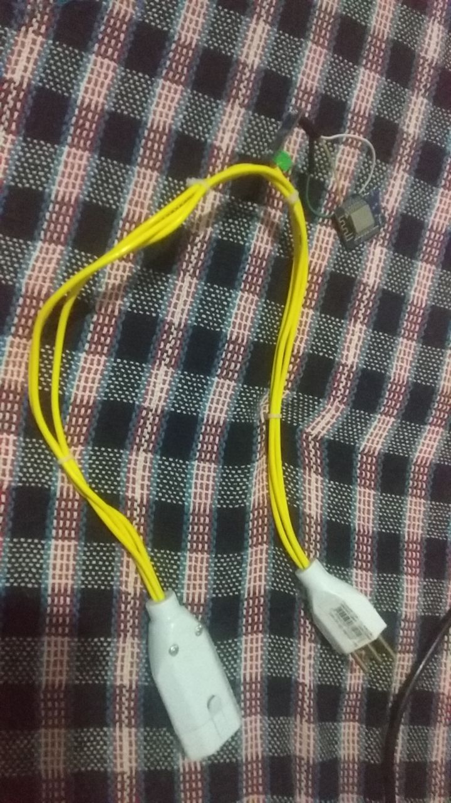
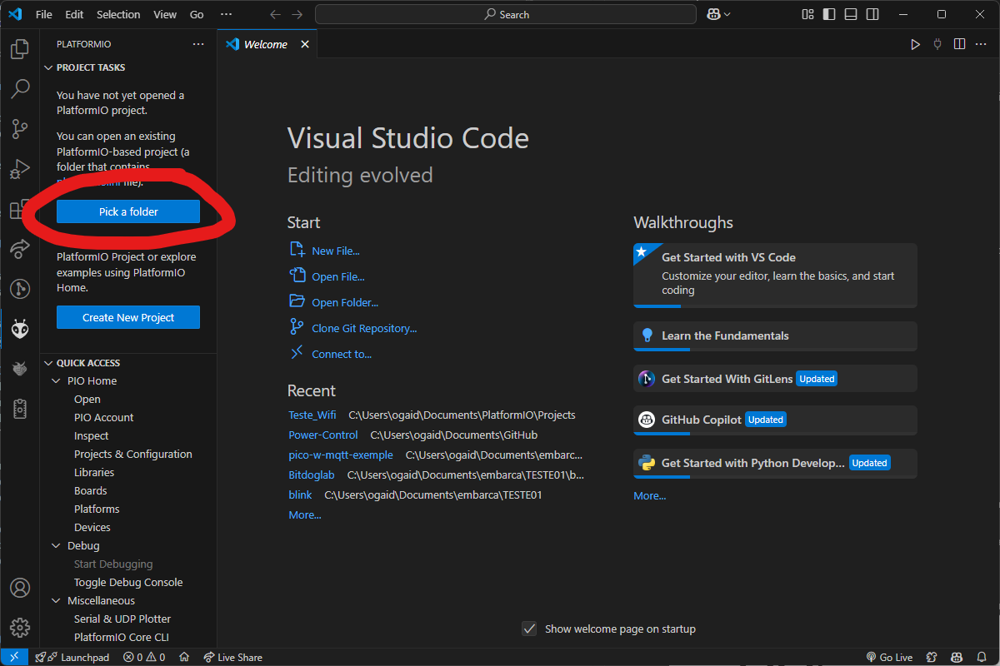

<h1 align="center"> Monitoramento energético 🔌</h1>
<div align="center">
  
  
  
</div>


# Índices 🗂
* [Sobre](#sobre-)
* [Como usar](#como-usar-)
* [Links](#links-)

# Sobre ☄

### Projeto de monitoramento energético utilizando arduino 

O projeto consiste em uma tomada que consegue ler qual o consumo atual do aparelho em tempo real por meio de um ESP d1 mini e um sensor de corrente instalados como intermedirários na alimentação de energia do eletronico.



<br/>

Com os dados em mãos o arduino também será capaz de salvar esses dados em um servidor de sua preferência. Assim, o dispositivo será capaz de mostrar qual o consumo dos aparelhos conectados para uma possível análise desses dados e planejamentos de estratégias para evitar o consumo ineficiente da energia elétrica.

<br/>

# Como usar 💻

Precisa de um servidor MQTT para testar o projeto? Caso tenha interesse, também disponibilizei o servidor no GitHub 😉

Repositório: [Power Control](https://github.com/danonep2/Power-Control)


Com servidor em mãos, vamos para o dispositivo

## Upload do código ⬆️
Para realizar o upload você precisa configurar no seu ambiente com o PlataformaIO. 
Basta seguir o passo a passo que os próprios desevolvedores disponibilizam

PlataformIO: [Instalação](https://docs.platformio.org/en/latest/core/installation/index.html)

Com o PlataformIO configurado, basta apenas abrir uma nova janela no seu Visual Studio, clicar na extensão na esquerca e clicar em "Pick a folder"


Após isso, o coder vai configurar quase tudo que precisar.

Você precisa adicionar uma biblioteca manualmente no projeto que é a EmonLib

EmonLib: [Site oficial](https://docs.arduino.cc/libraries/emonlib/)

Com o pacote baixado, você precisa extrair e copiar o conteudo para a pasta `.pio/libdeps/d1_mini_env`

Com tudo configurado, basta ir novamente na extensão do projeto na esquerda, clicar em build e depois em upload. Com isso, o software do sistema está quase pronto (verifique as observações no final)

## Montagem
### Itens necessários 📋
- ESP d1 mini (pode ser outro arduino)
- Sensor de corrente (ACS712)
- Cabos de energia 
- Pulgs de tomadas macho e femia

A montagem do projeto é simples: 
1. você precisa fazer uma extensão com os cabos e os plugs das tomadas
2. Com a extensão em mãos, famos realizar um corte em um dos fios, exceto o do meio (fio terra), e conectar as duas novas pontas no sensor de corrente
3. Com o intermediário conectado a tomada, conecte a alimentação do sensor no arduino junto com sua saida de dados na porta A0 (você pode alterar)
4. Com tudo ligado, agora só resta ligar e testar 😉

Para uma melhor visualização de como montar, veja a seguinte imagem:


### OBSERVAÇÔES ❗❗❗

- É necessário realizar a calibração do sensor para ter uma leitura mais precisa do consumo energético. Você consegue realizar essa calibração alterando o valor diretamente no código. Você terá que ir ajustando o valor e testando até encontrar o valor ideal
- O projeto está configurado para funcionar com 220v. Mas, caso queria utilizar com outras tensões, basta alterar no código
- Caso deseje, você consegue alterar em qual porta analógica que o sensor utilizará no sistema
- O sensor, mesmo sem nenhum aparelho conectado consumindo, emite um fraco ruído que pode alterar. Para eliminar este ruído e evitar que seja salvo esses dados, você também consegue ajustar na definição de ruído. Dessa forma, sempre que o código verificar que a leitura é um ruído não será enviado para o servidor

Todas os ajustes mensionados anteriormente são encontrados nas seguintes definições dentro do código:

```C
#define ruido 0.05        // Valor de ruído
#define tensao 220        // Tensão da rede
#define sensorPin A0      // Sensor de corrente
#define calibracao 9.78   // Valor de calibração
```

Se tudo já está nos conformes, então só resta aproveitar e realizar suas análises baseadas nos dados coletados 🫡


# Links 🔗
Backend: [Power Control](https://github.com/danonep2/Power-Control)

PlataformIO: [Instalação](https://docs.platformio.org/en/latest/core/installation/index.html)

EmonLib: [Site oficial](https://docs.arduino.cc/libraries/emonlib/)

Víde demonstrativo: [Youtube](https://youtu.be/wcLYKmU12DQ)

<hr>
<div align="center">

Criado por [Iago Amorim](https://github.com/danonep2).

</div>
